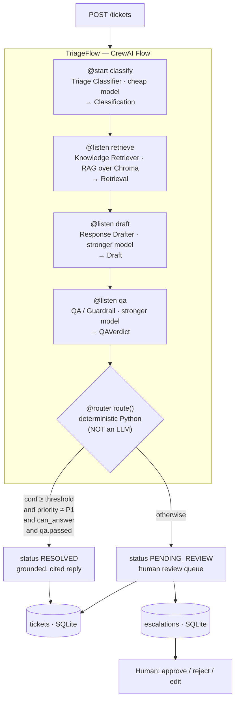

# Nimbus Support Triage Crew

A multi-agent **support-ticket triage** system built with **CrewAI Flows** and **FastAPI**. It
ingests a ticket, retrieves answers from a knowledge base (RAG), drafts a grounded reply,
QA-checks it for hallucination, then **deterministically** routes the ticket: auto-resolve
high-confidence answers, or escalate low-confidence / high-priority ones to a human review queue
(**human-in-the-loop**).

The knowledge base describes a fictional cloud-automation SaaS called **Nimbus**.

> **Runs with zero API keys and zero cost out of the box.** The default `LLM_PROVIDER=mock` returns
> canned structured responses so the entire pipeline, tests, and evals run fully offline. Point it at
> OpenAI when you want real answers.

---

## Why this exists (the problem)

Front-line support teams drown in repetitive tickets. Naively auto-answering with an LLM is risky:
models hallucinate, mishandle angry customers, and happily "resolve" things that legally require a
human (refunds, GDPR erasure, security incidents). The hard part isn't generating text — it's
**deciding what to auto-send vs. escalate, reliably.**

This project puts the reasoning in agents but the **decision in deterministic code**: routing is plain
Python over the agents' structured outputs, never an LLM. That makes the escalation gate auditable,
testable, and impossible to "prompt-inject" into auto-resolving a sensitive ticket.

---

## Architecture



**The Flow is the deterministic spine.** Four agents reason; the `@router` is plain Python.

### The four agents (all emit structured Pydantic v2 output)

| Agent | Model | Output | Role |
|---|---|---|---|
| **Triage Classifier** | `CLASSIFIER_MODEL` (cheap) | `Classification{category, priority, sentiment, rationale}` | Label the ticket |
| **Knowledge Retriever** | tool-driven (no LLM) | `Retrieval{snippets[], sources[], retrieval_confidence}` | RAG over Chroma, scored |
| **Response Drafter** | `DRAFTER_MODEL` (stronger) | `Draft{reply, citations[], can_answer, escalation_reason?}` | Grounded reply or "can't answer" |
| **QA / Guardrail** | `DRAFTER_MODEL` | `QAVerdict{grounded, tone_ok, completeness_ok, confidence, passed, issues[]}` | Catch hallucination, score confidence |

### Deterministic routing (`app/flow/routing.py`, a pure function)

```text
escalate if ANY of:
  - draft.can_answer is False           # context insufficient or needs human action
  - qa.passed is False                  # QA caught a problem
  - classification.priority == "P1"     # emergencies always get a human
  - qa.confidence < CONFIDENCE_THRESHOLD # not sure enough to auto-send
else: auto-resolve (RESOLVED) and return the drafted, source-cited reply
```

---

## Quickstart

```bash
make install   # create .venv (Python 3.11/3.12) + install pinned deps via uv
make ingest    # build the local Chroma vector store from data/knowledge_base/
make run       # start FastAPI on http://localhost:8000  (docs at /docs)
make test      # pytest — 35 tests, fully offline (LLM mocked)
make eval      # eval harness → metrics table
make lint      # ruff
```

Everything above needs **no API key**. To exercise the real pipeline, set `LLM_PROVIDER=openai` and
`OPENAI_API_KEY` in `.env`, then POST a ticket.

> First `make ingest` downloads the local embedding model (~90 MB, `all-MiniLM-L6-v2`) once into
> `.hf_cache/`; every run after that is fully offline.

### Docker

```bash
docker compose up --build      # ingests the KB, then serves the API on :8000
```

---

## API

| Method | Path | Purpose |
|---|---|---|
| `POST` | `/tickets` | Submit a ticket, run the pipeline, return resolved-or-escalated result |
| `GET` | `/tickets/{id}` | Ticket status + the full agent trace |
| `GET` | `/escalations` | List the human review queue (optional `?status=`) |
| `POST` | `/escalations/{id}/approve` · `/reject` · `/edit` | Human actions on a queued ticket |
| `POST` | `/ingest` | (Re)build the vector store from the KB |
| `GET` | `/health` | Liveness + effective config |

### Sample request / response

**An answerable ticket → auto-resolved, grounded, and cited:**

```bash
curl -s localhost:8000/tickets -H 'content-type: application/json' -d '{
  "subject": "Getting 429 errors from the API",
  "body": "We intermittently get HTTP 429 responses. What are the rate limits and which headers tell us the remaining quota?"
}'
```

```json
{
  "id": "656d16fae003",
  "status": "RESOLVED",
  "category": "technical",
  "priority": "P3",
  "sentiment": "neutral",
  "escalated": false,
  "confidence": 84,
  "reply": "Thanks for reaching out about \"Getting 429 errors from the API\". Based on our documentation: ## Limits by plan ...",
  "citations": ["06-api-rate-limits.md"],
  "estimated_cost_usd": 0.0
}
```

**An out-of-scope / P1 ticket → escalated to the human queue (no auto-reply):**

```bash
curl -s localhost:8000/tickets -H 'content-type: application/json' -d '{
  "subject": "URGENT: production is down",
  "body": "Every workflow is failing in production right now and customers are affected. We are on the Enterprise SLA."
}'
```

```json
{
  "id": "bf330e111070",
  "status": "PENDING_REVIEW",
  "category": "technical",
  "priority": "P1",
  "sentiment": "negative",
  "escalated": true,
  "confidence": 91,
  "reply": null,
  "escalation_reasons": ["priority_P1"]
}
```

A reviewer then resolves it:

```bash
curl -s -X POST localhost:8000/escalations/1/edit \
  -H 'content-type: application/json' \
  -d '{"final_reply": "We are on it — incident bridge opened, ETA 15 min."}'
```

---

## Evaluation

`make eval` runs the pipeline over `evals/dataset.jsonl` (18 labeled tickets) and reports four metrics.
Mock-mode results (deterministic, free, reproducible):

```text
================================================================
NIMBUS TRIAGE — EVAL RESULTS   provider=mock  n=18
================================================================
CLASSIFICATION
  category accuracy          ####################  100.0%  18/18
  priority accuracy          ####################  100.0%  18/18
RETRIEVAL
  hit@1                      ##################..   88.9%  16/18
  hit@4                      ####################  100.0%  18/18
GROUNDEDNESS  (heuristic, answerable replies only)
  grounded rate              ####################  100.0%  13/13
ESCALATION  (positive = escalate)
  precision                  ####################  100.0%  tp=6 fp=0
  recall                     ####################  100.0%  fn=0 tn=12
  f1                         ####################  100.0%
  accuracy                   ####################  100.0%
================================================================
estimated LLM cost this run: $0.00000  (mock = $0.00000)
================================================================
```

> **Honesty note:** the mock provider is a transparent, deterministic stand-in for the LLM (keyword
> classification + real RAG + rule-based drafting), calibrated to the labels — so these numbers measure
> the *harness and routing*, not a model. Groundedness in mock mode is a labeled heuristic. For real
> model numbers (LLM-as-judge groundedness included), run a budget-capped checkpoint:
>
> ```bash
> python -m evals.run_eval --provider openai --limit 4
> ```

---

## Project layout

```
app/
├── api/         FastAPI routers + DTOs (tickets, escalations, ingest)
├── flow/        CrewAI Flow (triage_flow.py) + deterministic router (routing.py)
├── crew/        Agents, tasks, Pydantic models, KB tool, mock + real engines
├── services/    embeddings · vector store (Chroma/Pinecone) · KB · LLM factory · storage · observability
└── core/        config (pydantic-settings) · logging · retry
data/
├── knowledge_base/   9 Nimbus markdown docs
└── sample_tickets.json
evals/           run_eval.py + dataset.jsonl (18 labeled rows)
tests/           routing · schemas · queue · mocked integration (35 tests)
```

Configuration is documented in [`.env.example`](.env.example) and [`CLAUDE.md`](CLAUDE.md).

---

## Design decisions

**Why CrewAI Flows here?** The task is a short, mostly-linear pipeline (classify → retrieve → draft →
QA) followed by a **deterministic branch**. CrewAI Flows model exactly this: `@start`/`@listen` for the
linear agent steps and `@router` for the branch — while each agent stays a first-class CrewAI Agent with
a typed Pydantic output. The orchestration reads like the architecture diagram.

**When I'd reach for LangGraph instead.** If the control flow were a genuine *graph* — cyclic
agent-to-agent negotiation, dynamic fan-out/fan-in, long-running stateful workflows with checkpoints and
human-in-the-loop *interrupts mid-graph*, or fine-grained per-node ret/replay — LangGraph's graph
model and persistence would carry more weight. Here the flow is a pipeline with one decision point, so
CrewAI Flows are the lighter, clearer fit. The routing logic is deliberately framework-agnostic
(`app/flow/routing.py` is pure Python), so swapping orchestrators wouldn't touch the gate.

**Routing is never an LLM.** The escalation decision is plain Python over structured outputs. It's
unit-tested at the threshold boundary (74 escalates, 75 resolves) and cannot be talked into
auto-resolving a P1 or a GDPR-erasure request.

**Retrieval is deterministic.** The "Knowledge Retriever" is tool-driven vector search, not an LLM —
it returns real snippets with source filenames and a computed confidence. That removes a hallucination
surface and a cost center, and makes citations trustworthy.

**Local embeddings by design.** `sentence-transformers/all-MiniLM-L6-v2` runs locally: ingest is free
and offline, and Chroma + Pinecone index *identical* vectors (we compute embeddings and hand them to
whichever store), so the vector backend is swappable without changing retrieval behavior.

**Mock-first for cost discipline.** Default `LLM_PROVIDER=mock` means the whole app — including
`POST /tickets`, the tests, and the evals — runs at $0. Real OpenAI calls happen only at explicit,
token-capped checkpoints; every real run logs token usage and estimated cost.

**Pluggable everything.** LLM provider, vector store, and database all sit behind small interfaces
(`get_llm`, `get_vector_store`, `Storage`) selected by env — Chroma↔Pinecone, SQLite↔Postgres,
mock↔OpenAI — with no changes to the Flow.

---

## Cost discipline

- Default `mock` provider → **$0**, no network.
- Every agent caps `max_tokens` (`CLASSIFIER_MAX_TOKENS`, `DRAFTER_MAX_TOKENS`, `QA_MAX_TOKENS`).
- Pricing (USD / 1M tokens, current): `gpt-4.1-nano` $0.10 in / $0.40 out; `gpt-4.1-mini` $0.40 in /
  $1.60 out. A full 3-agent run on a typical ticket is well under a cent.
- `--limit` on the eval harness caps how many tickets a real run touches.

---

## Limitations

- **Mock mode is a heuristic, not a model.** It's calibrated to the sample data to make the pipeline
  demonstrable offline; it is not a substitute for real LLM quality. Judge real behavior with
  `--provider openai`.
- **Small, synthetic KB.** Nine docs for one fictional product. Retrieval quality on a large, messy,
  real corpus would need chunking/reranking tuning and a hit@k regression suite.
- **Single-tenant, single-process.** SQLite + an in-process Chroma client are fine for a demo; a real
  deployment would use Postgres + a managed vector store (the interfaces already allow Pinecone/Postgres).
- **No auth / rate limiting / streaming** on the API — out of scope for this portfolio build.
- **Escalation queue is minimal.** Approve/reject/edit cover the loop; assignment, SLAs, and
  notifications are not implemented.
- **LLM-as-judge groundedness is single-shot.** A production eval would use multiple judges and
  human-labeled grounding references.

---

## License

MIT. The "Nimbus" product, its docs, and all sample tickets are fictional.
