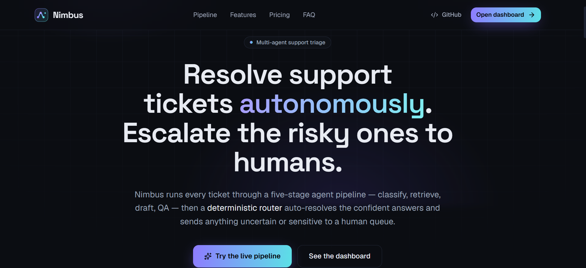
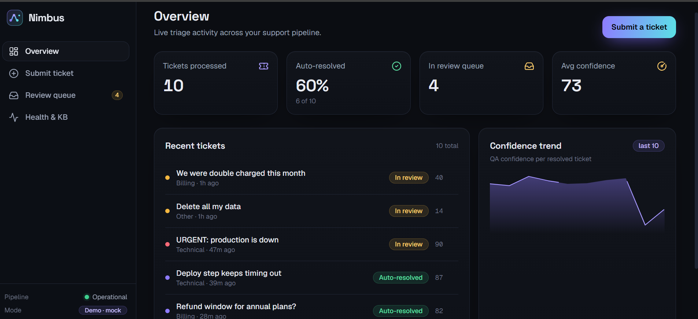
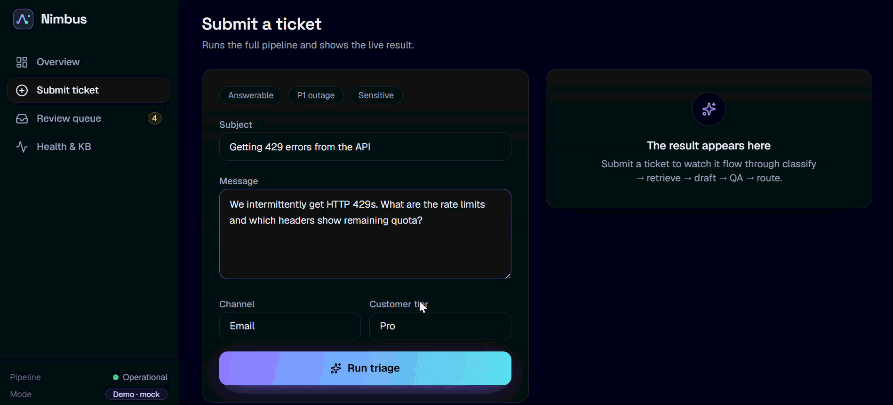

# Nimbus — Frontend

[](https://github.com/Tusharvijaypatil/crewai/actions/workflows/frontend.yml)

The web app for **Nimbus**, an autonomous support-ticket triage product: a marketing
landing page and a product dashboard that visualizes the multi-agent pipeline
(**Classify → Retrieve → Draft → QA → Route**). It's built against the FastAPI
backend's real contract but ships a complete in-browser **mock layer**, so the entire
experience — submitting tickets, watching the agent trace, working the human review
queue — runs fully offline with **no backend and no API keys**.

> Part of the [Nimbus Support Triage Crew](../README.md) monorepo. The backend (CrewAI
> + FastAPI) lives one level up; this folder is a self-contained Vite app.

## Screenshots

> **TODO:** drop real captures into `frontend/docs/` — the references below are placeholders.

| Landing | Dashboard | Pipeline |
| --- | --- | --- |
|  |  |  |

## Tech stack

- **React 19** + **Vite 8** + **TypeScript**
- **Tailwind CSS v4** — CSS-first `@theme` design tokens (no `tailwind.config.js`)
- **framer-motion** — staged pipeline animation, route transitions, meters
- **TanStack Query v5** — data fetching, cache, optimistic mutations
- **react-router-dom v7** — landing (`/`) + lazy-loaded dashboard (`/app/*`)
- **Radix UI** primitives + a small hand-rolled component layer (`cva` + `clsx` +
  `tailwind-merge` via the `cn` helper)
- **lucide-react** icons, **sonner** toasts
- **Vitest** + **React Testing Library** (unit/component) and **Playwright** (e2e)

## Design tokens

The visual language is defined once in [`src/index.css`](src/index.css) as Tailwind v4
`@theme` tokens and consumed everywhere — never ad-hoc hex values:

- **Dark-first.** A deep "ink" surface ramp (`--color-ink-900` page → `-850/-800/-700`
  raised) with hairline `--color-line` borders.
- **Signature gradient.** Brand **iris → aqua** (`#8E7BFF → #5BE1E6`) for the logo,
  hero, primary buttons, and the pipeline flow.
- **Semantic tones.** `emerald` = resolved/success, `amber` = in-review/escalate,
  `rose` = P1/danger, `iris`/`aqua` = informational. Confidence, QA, and priority
  always render as **color + iconography + number**, never a bare number. The
  domain→tone mappings live in [`src/lib/domain.ts`](src/lib/domain.ts).
- **Type.** Space Grotesk (display) · Geist (UI) · Geist Mono (data) — all bundled
  locally via `@fontsource`, so there are no external font requests.
- Motion respects `prefers-reduced-motion`.

## Mock vs. live (`VITE_USE_MOCKS`)

The app talks to a single typed API surface in [`src/lib/api.ts`](src/lib/api.ts) that
switches on one env var:

| `VITE_USE_MOCKS` | Behavior |
| --- | --- |
| **`true`** (default) | In-browser mock pipeline ([`src/lib/mocks.ts`](src/lib/mocks.ts)) — keyword classification, canned KB snippets, and the **same deterministic routing rule** as the backend. Seeded tickets + a working review queue. Zero network, zero cost. |
| `false` | Live FastAPI backend. Vite proxies `/api/*` → `http://localhost:8000` (see [`vite.config.ts`](vite.config.ts)). Start the backend first (`make run` in the repo root). |

To run against the live backend locally, create `.env.local`:

```bash
echo "VITE_USE_MOCKS=false" > .env.local
```

The mock layer is the deploy story: the production build defaults to mock mode, so the
static site is the full product demo with no infrastructure behind it.

## Getting started

```bash
npm install
npm run dev          # http://localhost:5173 (mock mode by default)
```

### Scripts

| Script | What it does |
| --- | --- |
| `npm run dev` | Vite dev server with HMR |
| `npm run build` | Type-check (`tsc -b`) + production build to `dist/` |
| `npm run preview` | Serve the production build locally |
| `npm run lint` | ESLint (flat config) |
| `npm run test` | Vitest unit/component suite (jsdom) |
| `npm run test:watch` | Vitest in watch mode |
| `npm run test:e2e` | Playwright e2e (builds + previews in mock mode, drives Chromium) |

First Playwright run needs the browser: `npx playwright install chromium`.

## Project structure

```
frontend/
├── e2e/                    # Playwright specs (submit → auto-resolve)
├── public/                 # static assets (nimbus.svg, og.png)
├── scripts/
│   └── generate-og.mjs     # renders public/og.png with Chromium + the design tokens
├── src/
│   ├── components/         # AppLayout, PipelineDiagram, ui (primitives), bits, brand
│   ├── lib/                # api · mocks · queries (TanStack) · types · domain · utils
│   ├── pages/              # Landing, Overview, Submit, TicketDetail, Queue, Health
│   ├── test/               # setup.ts + renderWithProviders / queryWrapper
│   ├── index.css           # Tailwind v4 @theme design tokens
│   └── main.tsx            # providers + router (dashboard routes lazy-loaded)
├── vite.config.ts          # @ alias + /api proxy
├── vitest.config.ts        # jsdom + globals + setup
└── playwright.config.ts    # mock-mode webServer
```

### Routes

| Route | Screen |
| --- | --- |
| `/` | Marketing landing — hero, animated pipeline, features, pricing, FAQ |
| `/app` | Overview — KPIs, recent tickets, confidence trend |
| `/app/submit` | Submit a ticket and watch the pipeline run live |
| `/app/tickets/:id` | Full agent trace (classify → retrieve → draft → QA → route) |
| `/app/queue` | Human review queue — approve / reject / edit |
| `/app/health` | Effective config + knowledge-base ingest |

## Testing

- **Unit / component** ([Vitest](https://vitest.dev) + RTL): routing-critical logic —
  the `confidenceTone`/`STATUS`/`humanizeReason` and `timeAgo`/`titleCase` helpers, the
  `ConfidenceMeter`/`ScoreRing` semantic tones, the `useEscalationAction` **optimistic
  update + rollback**, and `Submit`'s resolved-vs-escalated result. Tests are excluded
  from the production `tsconfig` build.
- **End-to-end** ([Playwright](https://playwright.dev)): one happy-path against the
  static mock build — submit an answerable ticket, see the pipeline animation, assert a
  RESOLVED result with a grounded reply.

## Deployment

Static, mock-first. The repo root ships a [`netlify.toml`](../netlify.toml) (base
`frontend/`, build `npm run build`, publish `dist/`, SPA redirect, `VITE_USE_MOCKS=true`).
Any static host works with a `/* → /index.html` rewrite for client-side routing.
